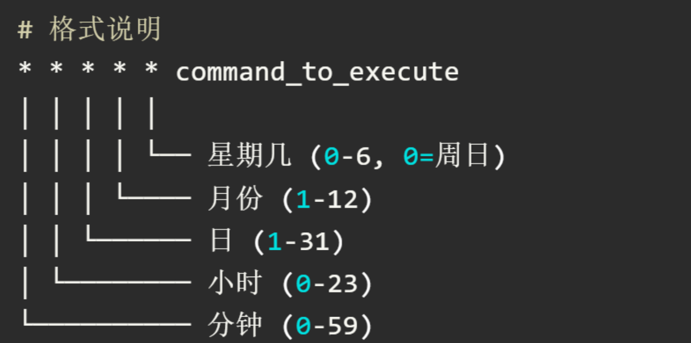
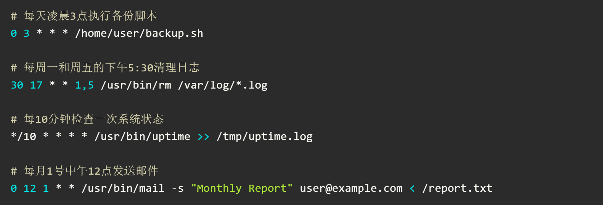

#! https://zhuanlan.zhihu.com/p/685502982

## linux命令自查手册
>持续更新

|     命令      |     解释     |
| :-----------: | :----------: |
|               |              |
|               |              |
| file filename | 识别文件类型 |

### Bash快捷键

在 Bash 中，默认的快捷键设置与 Emacs 的快捷键非常相似。Bash 使用 Readline 库来处理命令行编辑，而 Readline 提供了一组与 Emacs 编辑模式相兼容的快捷键。这使得许多在 Emacs 中常用的编辑命令在 Bash 中也可以使用。

除了默认的 Emacs 模式，Bash 也支持 Vi 模式。可以通过以下命令启用 Vi 模式，在 Vi 模式下，Bash 的快捷键将遵循 Vi 的编辑命令。

```bash
set -o vi
set -o emacs
```

|           命令           |                             解释                             |
| :----------------------: | :----------------------------------------------------------: |
|      光标移动快捷键      |                                                              |
|        `Ctrl + a`        |                      将光标移动到行首。                      |
|        `Ctrl + e`        |                      将光标移动到行尾。                      |
|        `Alt + f`         |                   将光标向前移动一个单词。                   |
|        `Alt + b`         |                   将光标向后移动一个单词。                   |
|        `Ctrl + f`        |                   将光标向前移动一个字符。                   |
|        `Ctrl + b`        |                   将光标向后移动一个字符。                   |
|        编辑快捷键        |                                                              |
|        `Ctrl + k`        |                删除光标位置到行尾的所有字符。                |
|        `Ctrl + u`        |                删除光标位置到行首的所有字符。                |
|        `Ctrl + w`        |             删除光标位置到前一个单词的所有字符。             |
|        `Alt + d`         |             删除光标位置到后一个单词的所有字符。             |
|        `Ctrl + d`        |      删除光标位置的字符（或退出当前会话，如果行为空）。      |
|        `Ctrl + h`        |         删除光标前的字符（与 `Backspace` 键相同）。          |
|        `Ctrl + y`        |                     粘贴最近删除的文本。                     |
|        `Ctrl + t`        |                交换光标处和前一个字符的位置。                |
| 历史记录和命令操作快捷键 |                                                              |
|        `Ctrl + r`        |                      搜索命令历史记录。                      |
|        `Ctrl + p`        |               从命令历史记录中调用上一条命令。               |
|        `Ctrl + n`        |               从命令历史记录中调用下一条命令。               |
|        `Alt + .`         | 插入上一条命令的最后一个单词（可以重复使用以插入更早的命令的最后一个单词） |
|           其他           |                                                              |
|        `Ctrl + l`        |              清屏（相当于执行 `clear` 命令）。               |
|        `Ctrl + s`        |                  停止终端输出（冻结终端）。                  |
|        `Ctrl + q`        |                  恢复终端输出（解冻终端）。                  |
|        `Ctrl + c`        |                   终止当前正在运行的命令。                   |
|        `Ctrl + z`        |               将当前正在运行的命令挂起到后台。               |
### 压缩、解压缩

|                             命令                             |                             解释                             |
| :----------------------------------------------------------: | :----------------------------------------------------------: |
|             tar -czvf archive.tar.gz folder_name             | -c 创建新归档<br/>-z 通过 gzip 压缩<br/>-v 显示详细信息（可选）<br/>-f 指定归档文件名 |
|            tar -cjvf archive.tar.bz2 folder_name             |                    -j 表示通过 bzip2 压缩                    |
|             tar -cJvf archive.tar.xz folder_name             |                     -J 表示使用 xz 压缩                      |
|       tar -xJvf example.tar.xz -C /path/to/destination       | 使用 xz 算法解压文件 example.tar.xz，，并以详细模式输出解压过程，同时将解压后的内容放到 /path/to/destination 目录 |
|      tar -xzvf filename.tar.gz -C /path/to/destination       | 使用 gzip 算法解压文件 filename.tar.gz，并以详细模式输出解压过程，同时将解压后的文件放入 /path/to/destination 目录 |
|                zip -r archive.zip folder_name                | -r 参数表示递归地将 folder_name 目录及其所有子目录和文件都打包到 archive.zip 中 |
|              zip archive.zip file1 file2 file3               | 将 `file1`、`file2`、`file3` 打包压缩成一个名为 `archive.zip` 的压缩包 |
|                         unzip *.zip                          |          解压当前目录下所有以 `.zip` 结尾的压缩文件          |
| `find . -name '*.zip' -exec sh -c 'for file do dirname="${file%.zip}"; unzip "$file" -d "$dirname"; done' _ {} \;` |                                                              |
| `find . -name '*.tar.gz' -exec sh -c 'for file do dirname="${file%.tar.gz}"; mkdir -p "$dirname"; tar -xzvf "$file" -C "$dirname"; done' _ {} \;` |                                                              |

### 文件操作

|              命令              |                             解释                             |
| :----------------------------: | :----------------------------------------------------------: |
| chown -R owner:group directory |     递归地改变文件夹及其所有子文件和子文件夹的属主和属组     |
|    安装.bundle为后缀的软件     | 在 Linux 中，带有 `.bundle` 后缀的文件通常是一种自解压或自安装包。安装这类文件的基本步骤如下：<br />chmod +x filename.bundle<br />sudo ./filename.bundle |

### find工具

|                 命令                  |               解释               |
| :-----------------------------------: | :------------------------------: |
| find [搜索路径] [搜索条件] [处理动作] |                                  |
|             **搜索路径**              |                                  |
|                  `.`                  |             当前目录             |
|         `/path/to/directory`          |             指定目录             |
|             **搜索条件**              |                                  |
|                `-name`                |            按名称搜索            |
|               `-iname`                |     按名称搜索（忽略大小写）     |
|                `-type`                | 按类型搜索（`f` 文件，`d` 目录） |
|                `-size`                |            按大小搜索            |
|               `-mtime`                |          按修改时间搜索          |
|               `-atime`                |          按访问时间搜索          |
|               `-ctime`                |        按状态变化时间搜索        |
|                `-user`                |           按所有者搜索           |
|               `-group`                |             按组搜索             |
|                `-perm`                |            按权限搜索            |
|             **处理动作**              |                                  |
|               `-print`                |      输出匹配的文件（默认）      |
|                `-exec`                |     对匹配的文件执行指定命令     |
|               `-delete`               |          删除匹配的文件          |
|                 `-ls`                 |           显示详细信息           |

### grep工具

|                            命令                            |                          解释                          |
| :--------------------------------------------------------: | :----------------------------------------------------: |
|                 grep [选项] 模式 [文件...]                 |               grep "pattern" example.txt               |
|                            `-i`                            |              忽略大小写（ignore case）。               |
|                            `-v`                            |          反向匹配，即显示不包含匹配模式的行。          |
|                            `-c`                            |              只输出匹配的行数（count）。               |
|                            `-l`                            |           显示包含匹配模式的文件名（list）。           |
|                            `-n`                            |              显示匹配行的行号（number）。              |
|                            `-H`                            |        显示匹配的文件名（默认对多个文件生效）。        |
|                        `-r` 或 `-R`                        |                 递归搜索目录中的文件。                 |
|                            `-w`                            |                    只匹配整个单词。                    |
|                            `-o`                            |                   只显示匹配的部分。                   |
|                          `-A NUM`                          |                匹配的行及其后 NUM 行。                 |
|                          `-B NUM`                          |                匹配的行及其前 NUM 行。                 |
|                          `-C NUM`                          |              匹配的行及其前后各 NUM 行。               |
| find . -type f -name '*.lib' -exec grep -Hn 'pattern' {} + |           查找所有 .lib 文件并执行 grep 搜索           |
|           grep -rn --include='*.lib' 'pattern' .           | 递归搜索当前目录及子目录下所有 .lib 文件中的 "pattern" |
|         grep -rn --include='*.{lib,a}' 'pattern' .         |                    搜索多个文件类型                    |
### 后台执行

|  命令  |                                                                                解释                                                                                |
| :----: | :----------------------------------------------------------------------------------------------------------------------------------------------------------------: |
|   fg   |    如果你在后台运行了一个程序，并且想要将其切换到前台，可以使用 `fg` 命令。首先使用 `jobs` 命令查看后台任务的编号，然后使用 `fg %job_number` 将任务切换到前台。    |
|   bg   | 如果你想将一个在后台暂停的任务重新切换到后台运行，可以使用 `bg` 命令。首先使用 `jobs` 命令查看后台任务的编号，然后使用 `bg %job_number` 将任务切换到后台继续运行。 |
| Ctrl+Z |                                                                  可以将当前正在前台运行的程序暂停                                                                  |
| nohup  |                       nohup 命令可以让程序忽略挂断（SIGHUP）信号，即使用户退出终端，程序也可以继续在后台运行。语法为：nohup ./your_program &                       |
|   &    |                                                        可以在命令行的末尾添加 `&` 符号来使命令在后台执行。                                                         |

### 定时命令

|    命令    |                             解释                             |
| :--------: | :----------------------------------------------------------: |
| crontab -e |                    编辑当前用户的定时任务                    |
| crontab -l |                    列出当前用户的定时任务                    |
| crontab -r |                删除所有定时任务（谨慎操作！）                |
|            |  |
|            |  |


### 历史命令

|   命令   |                                                                                         解释                                                                                          |
| :------: | :-----------------------------------------------------------------------------------------------------------------------------------------------------------------------------------: |
| history  |                                              `history` 命令会列出之前执行过的命令历史记录，每条命令前面带有一个编号。history \| grep ls                                               |
| Ctrl + R | 按下 `Ctrl + R` 键会进入逆向搜索模式，你可以开始输入你记得的关键词，系统会自动显示最接近的匹配项。一旦找到想要的命令，按下 `Enter` 键执行，或者按下 `Ctrl + R` 继续查找下一个匹配项。 |
|    !!    |                                                                            输入 `!!` 会执行最后一条命令。                                                                             |
|    !n    |                                                                  使用 `!n` 来执行历史记录中特定编号 `n` 对应的命令。                                                                  |

### 查看系统信息

|        命令         |                      解释                      |
| :-----------------: | :--------------------------------------------: |
| cat /etc/os-release |       显示当前 Linux 系统的发行版信息等        |
|      uname -a       | 显示系统的内核版本、操作系统名称和版本号等信息 |
|      uname -r       |           显示当前系统使用的内核版本           |
|   lsb_release -a    | 显示系统的发行版信息，包括发行版名称、版本号等 |

### 查看处理器信息

|       命令        |                             解释                             |
| :---------------: | :----------------------------------------------------------: |
| cat /proc/cpuinfo |                  显示详细的 CPU 信息<br />                   |
|       lscpu       | 显示 CPU 体系结构信息<br />Socket(s): 物理处理器插槽数（即物理 CPU 数量）<br/>Core(s) per socket: 每个处理器的核心数<br/>Thread(s) per core: 每个核心的线程数（如启用了超线程则可能大于 1） |
|       nproc       | 返回系统可用的处理单元总数（逻辑处理器数），通常等于“Socket 数 × 核心数 × 每核心线程数”。 |

### 查看进程信息

|                             命令                             |            解释             |
| :----------------------------------------------------------: | :-------------------------: |
|                           ps -aux                            |   显示所有进程的详细信息    |
|                       ps -u <username>                       |     查看特定用户的进程      |
| ps -eo user,%cpu --sort=-%cpu \| awk '{arr[$1]+=$2} END {for (i in arr) print i, arr[i]"%"}' | 统计所有用户的 CPU 总使用率 |
| watch -n 5 "ps -eo user,%cpu --sort=-%cpu \| awk '{arr[\$1]+=\$2} END {for (i in arr) print i, arr[i]\"%\"}'" |        实时监控脚本         |
|                          kill <PID>                          |        终止单个进程         |
|                        kill -9 <PID>                         |        强制终止进程         |
|                       pkill -u wangwy                        |    批量终止用户所有进程     |

### 网络管理

|                 命令                  |                             解释                             |
| :-----------------------------------: | :----------------------------------------------------------: |
|          nmcli device status          |        显示网络设备的状态（如 `wifi`、`ethernet` 等）        |
|             ip link show              | 显示所有网络接口及其状态（`UP` 表示已启用，`DOWN` 表示已关闭） |
|               ifconfig                |    显示所有网络接口的详细信息（需要安装 `net-tools` 包）     |
|    sudo ip link set <接口名> down     |                       关闭 `eth0` 接口                       |
|     sudo ip link set <接口名> up      |                       启用 `eth0` 接口                       |
| sudo nmcli device disconnect <接口名> |                       关闭 `eth0` 接口                       |
|  sudo nmcli device connect <接口名>   |                       启用 `eth0` 接口                       |
|      sudo ifconfig <接口名> down      |                       关闭 `eth0` 接口                       |
|       sudo ifconfig <接口名> up       |                       启用 `eth0` 接口                       |
|          watch -n 1 ifconfig          | 使用 watch 命令周期性地查看 ifconfig 命令的输出，实现每秒更新一次网络接口的信息。退出按`CTRL-C` |
|             sudo nload -m             |                     查看所有网卡实时网速                     |

### cloc代码统计

| 命令 |                             解释                             |
| :--: | :----------------------------------------------------------: |
| cloc | `cloc` 是一个用于统计源代码行数的命令行工具。它可以分析多种编程语言的代码，并生成代码统计报告，包括空白行、注释行和实际代码行数。 |

### git工具

> Git 是分布式版本控制系统，用于跟踪代码变更、协作开发和项目管理。以下是常用命令分类整理：

|                       命令                        | 解释                                                         |
| :-----------------------------------------------: | :----------------------------------------------------------- |
|                 **git checkout**                  | 用于切换分支、恢复工作区文件以及创建新分支                   |
|            git checkout <branch-name>             | 切换到指定的分支                                             |
|          git switch -c <new-branch-name>          |                                                              |
|         git checkout -b <new-branch-name>         | 创建一个新的分支并切换到该分支                               |
|              git checkout -- <file>               | 从当前分支中恢复指定的文件，放弃这些修改并恢复到最新提交的状态， |
|                 git checkout -- .                 | 将工作区中的所有文件恢复到最近一次提交的状态，但不会影响暂存区中的文件 |
|            git checkout <commit-hash>             | 切换到指定的提交（会使工作区进入“分离头指针”状态）。         |
|        git checkout <分支名> -- <文件路径>        | 从指定分支中提取特定文件到当前分支的工作目录中               |
|   git checkout <branch_name>~<n> -- <file_path>   | **`~<n>`**：表示从分支的最新提交向前回溯 `n` 个提交。        |
|      git checkout <tag_name> -- <file_path>       | 切换到指定标签的版本                                         |
|     git checkout <commit_hash> -- <file_path>     | 切换到指定提交的版本                                         |
|                                                   |                                                              |
|        git checkout -b 新分支名 提交哈希值        | 从特定提交创建新分支                                         |
|                  **git branch**                   | 用于在 Git 中管理分支，可以用于列出、创建、删除和重命名分支。 |
|                    git branch                     | 列出本地仓库中的所有分支                                     |
|                   git branch -a                   | 加上 `-a` 选项可以列出所有分支，包括远程分支                 |
|                   git branch -r                   | 列出所有远程分支                                             |
|           git branch <new-branch-name>            | 创建一个新的分支                                             |
|            git branch -d <branch-name>            | 删除一个本地分支                                             |
|            git branch -D <branch-name>            | 如果分支没有被合并，使用 `-d` 会失败。这是为了防止潜在的数据丢失。如果确实要强制删除未合并的分支，可以使用 |
|                git branch -M main                 | 重命名当前分支                                               |
| git branch -m <old-branch-name> <new-branch-name> | 重命名指定的分支                                             |
|                   **git push**                    | 将本地存储库中的更改推送到远程存储库                         |
|                     git push                      | 将当前分支推送到其上游分支。上游分支通常是远程仓库中的一个分支，已经通过 `git branch --set-upstream-to` 或 `git push -u` 命令进行配置。 |
|           git push -u <remote> <branch>           | 将本地分支推送到远程分支，并设置上游跟踪。如果是第一次推送该分支，这是一个很有用的选项。 |
|        git push <remote> --delete <branch>        | 删除远程仓库中的分支。                                       |
|              git push --all <remote>              | 将本地所有分支推送到远程仓库。                               |
|             git push <remote> --tags              | 将本地所有标签推送到远程仓库。                               |
|      git push origin --delete feature-branch      | 删除远程分支                                                 |
|           git branch -d feature-branch            | 删除本地分支                                                 |
|                   **git reset**                   |                                                              |
|               git reset --hard HEAD               | 将工作区和暂存区中的文件恢复到上一次提交的状态               |
|             git reset --soft HEAD~10              | 撤销最近 10 次提交的 Git 命令，但保留所有修改内容在暂存区<br />  撤销提交历史但保留代码修改，便于重新提交，适合未推送的本地提交调整，已推送需谨慎使用 `--force` |
|                  **git restore**                  |                                                              |
|            git restore --staged <file>            | 将暂存区中的文件恢复到工作区，即取消暂存                     |
|              git restore --staged .               | 取消所有暂存的文件                                           |
|                   **git clean**                   |                                                              |
|                   git clean -f                    | 删除工作区中未被追踪的文件                                   |
|                   git clean -n                    | 查看将要被删除的文件，而不实际删除它们                       |
|               **git update-index**                |                                                              |
|     git update-index --assume-unchanged file      | 暂时停止跟踪某个文件的更改                                   |
|    git update-index --no-assume-unchanged file    | 恢复追踪某个文件的修改                                       |
|                                                   |                                                              |
|               git status --ignored                | 检查哪些文件会被忽略                                         |
|          git rm -r --cached <文件/目录>           |                                                              |
|               git rm -r --cached .                | 将所有文件/目录从 Git 跟踪中移除，但保留在工作区             |
|              git merge时本地文件冲突              | 1. 提交本地更改<br /># 将本地更改添加到暂存区<br/>git add apps/common/runtime.mk hardware/Makefile<br/># 提交更改<br/>git commit -m "保存本地更改"<br/>br/># 执行合并操作<br/>git merge <branch-name><br />2. 暂存本地更改<br /># 暂存本地更改<br/>git stash<br/>br/># 执行合并操作<br/>git merge <branch-name><br/>br/># 合并完成后恢复暂存的更改<br/>git stash pop<br /><br />3. 手动检查冲突<br /># 查看冲突文件<br/>git status<br/># 手动解决冲突后，标记冲突已解决<br/>git add <conflicted-file><br/># 完成合并<br/>git commit |

|                 命令/操作                 |                    解释                    | 类别     |
| :---------------------------------------: | :----------------------------------------: | -------- |
|  `git config --global user.name "姓名"`   |               设置全局用户名               | 配置     |
|  `git config --global user.email "邮箱"`  |                设置全局邮箱                | 配置     |
| `git config --global alias.[别名] [命令]` |  自定义命令别名（如 `st` 代替 `status`）   | 配置     |
|                `git init`                 |        将当前目录初始化为 Git 仓库         | 仓库管理 |
|           `git clone <仓库URL>`           |             克隆远程仓库到本地             | 仓库管理 |
|             `git add <文件>`              | 将文件添加到暂存区（`git add .` 添加全部） | 暂存操作 |
|          `git commit -m "消息"`           |        提交暂存区内容并添加提交说明        | 提交操作 |
|           `git commit --amend`            |  **修改最近一次提交**（可修正消息或内容）  | 提交操作 |
|               `git status`                |           查看工作区和暂存区状态           | 状态查询 |
|                `git diff`                 |            查看未暂存的修改差异            | 状态查询 |
|            `git diff --staged`            |            查看已暂存的修改差异            | 状态查询 |
|                 `git log`                 |        显示提交历史（默认时间倒序）        | 提交历史 |
|        `git log --oneline --graph`        |        简化提交历史并显示分支拓扑图        | 提交历史 |
|          `git checkout <分支名>`          |               切换到指定分支               | 分支管理 |
|        `git checkout -b <新分支>`         |             创建并切换到新分支             | 分支管理 |
|               `git branch`                |   列出所有本地分支（`-a` 包含远程分支）    | 分支管理 |
|         `git branch -d <分支名>`          |              删除已合并的分支              | 分支管理 |
|         `git branch -D <分支名>`          |          **强制删除未合并的分支**          | 分支管理 |
|           `git merge <分支名>`            |          将指定分支合并到当前分支          | 分支操作 |
|           `git rebase <分支名>`           |       **变基操作**（线性化提交历史）       | 分支操作 |
|       `git remote add <名称> <URL>`       |      添加远程仓库（默认名 `origin`）       | 远程操作 |
|           `git fetch <远程名>`            |       拉取远程仓库更新（不自动合并）       | 远程操作 |
|        `git pull <远程名> <分支>`         |        拉取远程分支并合并到当前分支        | 远程操作 |
|        `git push <远程名> <分支>`         |           推送本地分支到远程仓库           | 远程操作 |
|            `git push --force`             |        **强制推送**（覆盖远程历史）        | 远程操作 |
|            `git reset HEAD~1`             |  撤销最近一次提交（默认 `--mixed` 模式）   | 撤销操作 |
|         `git reset --soft HEAD~1`         |         撤销提交但保留修改到暂存区         | 撤销操作 |
|         `git reset --hard HEAD~1`         |     **彻底丢弃最近一次提交和所有修改**     | 撤销操作 |
|                `git stash`                |     临时保存未提交的修改（进入暂存栈）     | 暂存操作 |
|              `git stash pop`              |     恢复最近一次暂存的修改并删除栈记录     | 暂存操作 |
|              `git clean -fd`              |         **删除未跟踪的文件和目录**         | 清理操作 |
|            `git tag <标签名>`             |     创建轻量标签（`-a` 创建附注标签）      | 标签管理 |
|           `git tag -d <标签名>`           |                删除本地标签                | 标签管理 |
|             `git push --tags`             |           推送所有标签到远程仓库           | 标签管理 |
|        `git cherry-pick <提交ID>`         |          将指定提交应用到当前分支          | 高级操作 |
|            `git bisect start`             |          启动二分查找定位问题提交          | 高级操作 |
|               `git reflog`                |    查看所有操作记录（包括已删除的提交）    | 高级操作 |
|         `git submodule add <URL>`         |                 添加子模块                 | 高级操作 |

#### 1. **常用配置示例**
```bash
# ~/.gitconfig 配置示例
[alias]
    st = status
    co = checkout
    br = branch
    ci = commit
    lg = log --color --graph --pretty=format:'%Cred%h%Creset -%C(yellow)%d%Creset %s %Cgreen(%cr) %C(bold blue)<%an>%Creset' --abbrev-commit
```

#### 2. **忽略文件配置（.gitignore）**
```bash
# 忽略所有 .log 文件
*.log

# 忽略目录
build/
node_modules/

# 例外规则（不忽略特定文件）
!important.log
```

#### 3. **分支策略建议**
- `main`/`master`: 主分支（仅用于发布稳定版本）
- `develop`: 开发分支
- `feature/xxx`: 功能分支
- `hotfix/xxx`: 热修复分支

#### 4. **提交消息规范**
推荐使用 [Conventional Commits](https://www.conventionalcommits.org/) 格式：
```bash
feat: 添加用户登录功能
fix: 修复支付接口超时问题
docs: 更新 README 文档
style: 调整代码缩进格式
refactor: 重构用户模块代码
test: 添加单元测试用例
chore: 更新依赖包版本
```

#### 场景1：修复紧急Bug

```bash
git checkout main              # 切换到主分支
git pull origin main           # 拉取最新代码
git checkout -b hotfix/header  # 创建热修复分支
# 修改代码并测试
git add .
git commit -m "fix: 修复页面头部样式错位"
git push origin hotfix/header  # 推送分支
# 创建 Pull Request 合并到 main 分支
```

#### 场景2：协作开发功能
```bash
git clone https://github.com/user/project.git
git checkout -b feature/search  # 创建功能分支
# 开发搜索功能
git add .
git commit -m "feat: 添加商品搜索接口"
git push origin feature/search  # 推送分支
# 发起 Code Review 后合并到 develop 分支
```

#### 场景3：撤销错误提交
```bash
git reset --soft HEAD~1        # 撤销提交但保留修改
# 重新修改代码
git add .
git commit -m "fix: 正确实现用户权限校验"
git push --force               # 强制覆盖远程错误提交
```


### Docker

|                             命令                             |            解释            |
| :----------------------------------------------------------: | :------------------------: |
| ` docker run -itd --hostname lizhen --mac-address 02:42:ac:11:00:02 -v /etc/localtime:/etc/localtime:ro -v /tmp/.X11-unix:/tmp/.X11-unix -v $HOME/.Xauthority:/root/.Xauthority -v $HOME/mydata:/mydata -e DISPLAY=$DISPLAY -e GDK_SCALE -e GDK_DPI_SCALE --name EDA phyzli/ubuntu18.04_xfce4_vnc4server_synopsys`:w |                            |
|                   docker container rm EDA                    | 删除一个处于终止状态的容器 |
|                  docker container rm EDA -f                  |    删除一个运行中的容器    |

### VNC

|                        命令                         |     解释     |
| :-------------------------------------------------: | :----------: |
|  sudo systemctl start vncserver@:<display>.service  |   启动服务   |
|  sudo systemctl stop vncserver@:<display>.service   |   停止服务   |
| sudo systemctl restart vncserver@:<display>.service |   重启服务   |
| sudo systemctl status vncserver@:<display>.service  | 查看服务状态 |
| sudo systemctl enable vncserver@:<display>.service  | 设置开机自启 |
| sudo systemctl disable vncserver@:<display>.service | 取消开机自启 |


### tmux工具

> tmux 是一个强大的终端复用工具，支持多窗口、分屏、会话管理，适用于高效终端操作和远程任务维护。

|       命令/快捷键       |                  解释                  |   类别   |
| :---------------------: | :------------------------------------: | :------: |
|         `tmux`          |            启动新的匿名会话            | 会话管理 |
|  `tmux new -s <name>`   |        创建**命名会话**（推荐）        | 会话管理 |
|        `tmux ls`        |          列出所有已存在的会话          | 会话管理 |
| `tmux attach -t <name>` |    重新连接指定会话（默认最近会话）    | 会话管理 |
|      `Ctrl + b, d`      |        分离当前会话（后台运行）        | 会话管理 |
|      `Ctrl + b, $`      |             重命名当前会话             | 会话管理 |
|      `Ctrl + b, c`      |       在当前会话中**创建新窗口**       | 窗口管理 |
|      `Ctrl + b, n`      |            切换到下一个窗口            | 窗口管理 |
|      `Ctrl + b, p`      |            切换到上一个窗口            | 窗口管理 |
|     `Ctrl + b, 0-9`     |         直接切换到第0-9号窗口          | 窗口管理 |
|      `Ctrl + b, &`      |     **强制关闭当前窗口**（需确认）     | 窗口管理 |
|      `Ctrl + b, w`      |      显示窗口列表并切换（交互式）      | 窗口管理 |
|      `Ctrl + b, %`      |          垂直分屏（左右布局）          | 分屏管理 |
|      `Ctrl + b, "`      |          水平分屏（上下布局）          | 分屏管理 |
|   `Ctrl + b, 方向键`    |            在分屏间切换焦点            | 分屏管理 |
|      `Ctrl + b, x`      |         关闭当前分屏（需确认）         | 分屏管理 |
|      `Ctrl + b, z`      |  **最大化/恢复当前分屏**（临时全屏）   | 分屏管理 |
| `Ctrl + b, Ctrl+方向键` |    调整分屏大小（按住Ctrl连续调整）    | 分屏管理 |
|      `Ctrl + b, [`      | 进入**复制模式**（支持文本选择和翻页） | 其他功能 |
|      `Ctrl + b, ]`      |           粘贴复制的文本内容           | 其他功能 |
|      `Ctrl + b, ?`      |         查看所有快捷键帮助文档         | 其他功能 |
|      `Ctrl + b, :`      |   进入命令模式（支持高级操作和配置）   | 其他功能 |
|      `Ctrl + b, t`      |     显示当前时间（临时状态栏显示）     | 其他功能 |
|      `Ctrl + b, q`      |      显示分屏编号（快速跳转分屏）      | 其他功能 |

1. **自定义分屏布局**：
   在 `~/.tmux.conf` 中可定义分屏快捷键，例如：

   ```
   BASHbind-key v split-window -h  # 绑定垂直分屏到 Ctrl + b, v
   bind-key h split-window -v  # 绑定水平分屏到 Ctrl + b, h
   ```

2. **会话共享**：
   通过 `tmux -S /tmp/socket` 创建共享会话，其他用户通过 `tmux -S /tmp/socket attach` 加入协作。

3. **状态栏定制**：
   在配置文件中自定义状态栏信息（如显示电量、网络等）：

   ```
   BASHset -g status-left "Session: #S | "
   set -g status-right "#{cpu_percentage} | %H:%M "
   ```

4. **批量操作**：
   使用 `synchronize-panes on` 命令实现**同步输入**（所有分屏执行相同命令）。

5. **快速跳转**：

   - `Ctrl + b, f`：根据名称查找窗口
   - `Ctrl + b, s`：显示会话列表并切换

> tmux 是一个终端复用工具，允许你在一个终端窗口中创建多个面板（panes），并可以在它们之间自由切换。

|       命令       |     解释     |
| :--------------: | :----------: |
|       tmux       |  启动 tmux   |
|   Ctrl + b, %    |   水平分屏   |
|   Ctrl + b, "    |   垂直分屏   |
| Ctrl + b, 方向键 |   切换面板   |
| exit 或 Ctrl + d | 关闭当前面板 |
|   Ctrl + b, d    |   分离会话   |
|   tmux attach    | 重新连接会话 |


### screen工具

> screen 是一个终端复用工具，支持会话管理、分屏、窗口管理和后台任务运行，适合长时间维护远程会话和多任务操作。

|         命令/快捷键          |                    解释                    |   类别   |
| :--------------------------: | :----------------------------------------: | :------: |
|           `screen`           |              启动新的匿名会话              | 会话管理 |
|      `screen -S <name>`      |          创建**命名会话**（推荐）          | 会话管理 |
|         `screen -ls`         |            列出所有已保存的会话            | 会话管理 |
|     `screen -r [会话ID]`     | 重新连接指定会话（默认连接最近分离的会话） | 会话管理 |
|     `screen -x [会话ID]`     |          **共享会话**（多人协作）          | 会话管理 |
|        `Ctrl + a, d`         |          分离当前会话（后台运行）          | 会话管理 |
|        `Ctrl + a, c`         |         在当前会话中**创建新窗口**         | 窗口管理 |
|        `Ctrl + a, n`         |              切换到下一个窗口              | 窗口管理 |
|        `Ctrl + a, p`         |              切换到上一个窗口              | 窗口管理 |
|        `Ctrl + a, "`         |             显示窗口列表并切换             | 窗口管理 |
|       `Ctrl + a, 0-9`        |           直接切换到第0-9号窗口            | 窗口管理 |
|        `Ctrl + a, k`         |            **强制关闭当前窗口**            | 窗口管理 |
| `Ctrl + a, :number <新位置>` |            将窗口移动到指定位置            | 窗口管理 |
|        `Ctrl + a, A`         |            为当前窗口设置新名称            | 窗口管理 |
|        `Ctrl + a, S`         |            水平分割窗口（分屏）            | 分屏管理 |
|       `Ctrl + a, Tab`        |              在分屏间切换焦点              | 分屏管理 |
|        `Ctrl + a, Q`         |          关闭当前分屏（保留窗口）          | 分屏管理 |
|     `Ctrl + a, :resize`      |      调整分屏大小（交互式输入百分比）      | 分屏管理 |
|        `Ctrl + a, [`         | 进入**复制模式**（支持文本选择和历史回滚） | 其他功能 |
|        `Ctrl + a, ]`         |             粘贴复制的文本内容             | 其他功能 |
|        `Ctrl + a, ?`         |           查看所有快捷键帮助文档           | 其他功能 |
|        `Ctrl + a, A`         |               重命名当前窗口               | 其他功能 |
|        `Ctrl + a, x`         |           **锁定会话**（需密码）           | 安全功能 |
|        `Ctrl + a, \`         |             完全退出screen工具             | 退出操作 |