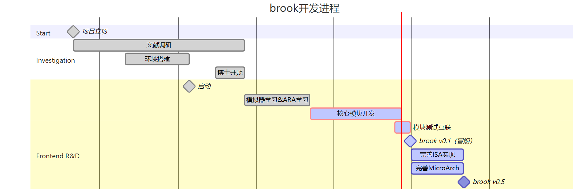
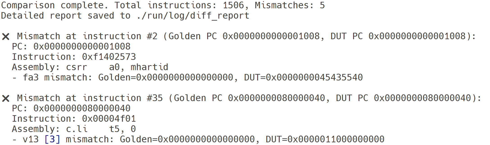

## WorkWeek8 2025/2/21

### 工作进展

- bananapi-f3板卡jtag调试，目前存在IDcode匹配错误的问题
- 勘智K230板卡待测
- MLperf AI benchmark学习，计划在上两块板卡上进行测试MLperf Tiny 
- MLperf AI benchmark在Ara上进行测试，探究RVV处理器关键指令以及微结构设计对测试得分的影响
- 学习并改写Ara
- Brook编译环境、工具链搭建
- Gem5模拟器全面学习，进行建模
- DeepseekR1-70B在内网服务器的部署

### 工作计划

- 继续完成专利

## WorkWeek10 2025/3/7

### 工作进展

- Brook编译环境、工具链搭建
- 学习并改写Ara，在tsmc28nm下综合，先综合功能部件
- 专利返修修改完成，正式提交

- 勘智K230板卡jTAG测试调通

  > MLperf AI benchmark学习，在上两块板卡上进行测试MLperf Tiny 
  >
  > MLperf AI benchmark在Ara上进行测试，探究RVV处理器关键指令以及微结构设计对测试得分的影响

- bananapi-f3板卡jtag调试，存在IDcode匹配错误的问题，暂时搁置

- DeepseekR1-70B在内网服务器的部署，已经部署完成

### 工作计划

## WorkWeek12 2025/3/20

### 工作进展

- 主核选择开源玄铁C910，环境已经跑通，各脚本以及testbench学习完成；

- 本地服务器Synopsys整套EDA软件安装完成

- Brook编译环境、工具链搭建，功能部件完成基本逻辑、加减、乘法等运算部分，借鉴开源处理器，查阅相关资料，理清基本架构；

- 阅读玄铁较多软件开发工具、调试手册、矩阵扩展指令集手册等文档，了解其所进行过测试的基准测试集；

- 从软硬结合角度进行向量处理器的优化，高性能计算库OpenBLAS学习，将矩阵-矩阵运算、矩阵-向量运算、向量-向量运算等函数运行在ARA上；

- tsmc28nm综合环境下，完成了单个功能部件的综合；

- 通过高校计划向ARM申请关于TSMC28nm的memory compiler的使用权，目前正在等待结果；

  

  **github开发热度，持续进行中：**

  

### 工作计划

进行brook主体的搭建

## WorkWeek14 2025/4/10

### 工作进展

- OpenC910 Coremark测试 ：6.165684 (iterations/sec)/MHz@-o3

- ARA的RVV SV实现整数、定点功能部件时序评估 能够满足2Ghz@TSMC28nm

- RVV指令功能梳理

- Memory System相关知识学习

### 工作计划

进行brook主体的搭建

## WorkWeek16 2025/4/24

### 工作进展

- RVV_decode模块框架搭建，完成度35%

- AXI总线学习

- spike模拟器环境搭建

- RISC-V工具链 从GCC迁移到LLVM

- 计划在6月第一周，完成0.1版本的基本功能代码

### 工作计划

进行brook主体的搭建

## WorkWeek18 2025/5/8

### 工作进展

- RVV_decode模块框架搭建，完成度80%
- LSU模块、寄存器堆设计
- spike模拟器环境修改
- C910 RTL代码学习
- 《一种处理器前导和尾数连续位并行计数装置及方法》撰写40%

### 工作计划

继续进行brook主体的搭建

RV峰会 PPT制作

## WorkWeek20 2025/6/6

### 工作进展

- LSU模块（50%）、外部SRAM存储控制器、AXI协议互联
- C910 RTL代码学习
- RISC-V中国峰会报名《中科本原第二代RISC-V架构DSP处理器》已提交
- 《一种处理器前导和尾数连续位并行计数装置及方法》撰写完成，修改提交

### 工作计划

继续上述工作

## WorkWeek22 2025/6/21

### 工作进展

 

- 核心功能模块主要逻辑完成
- 清除代码Lint错误
- 理想指令发射器与各功能模块互联仿真，可以跑通
- 预计一周能达到0.1的状态

- 指令集验证环境完成

  

  

### 工作计划

继续上述工作
