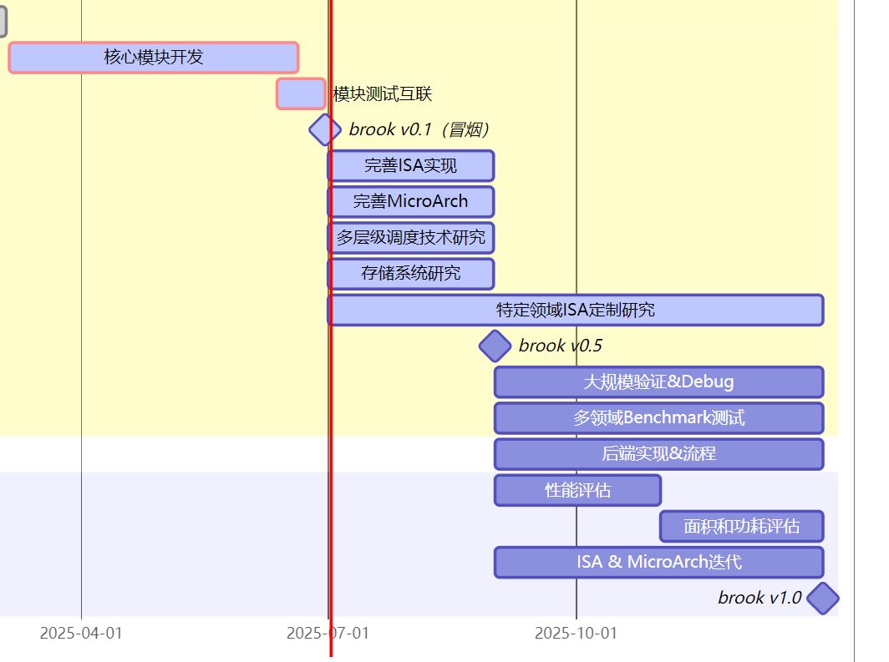
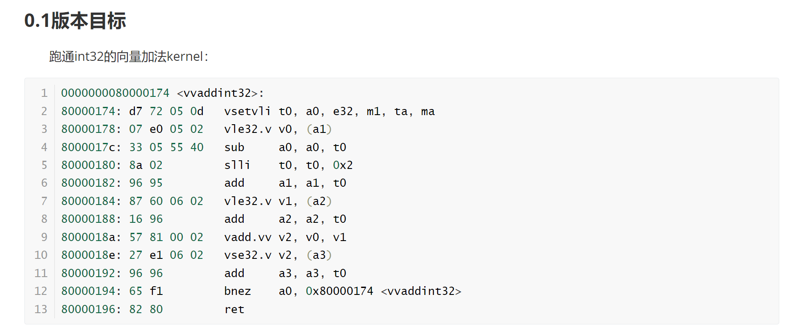

## WorkWeek24 2025/7/3

### 工作进展

- 理想指令发射器与各功能模块互联仿真，可以跑通，达到0.1的状态
  - 完成0.1版本基本功能开发2025.06.30，0.1版本的特征：
    - 实现部分指令，可以实现部分指令的冒烟测试

    - 部分核心功能模块的主要逻辑ready，但逻辑不完善
    - 模块互联之后可以支持部分指令的冒烟
    - 理想指令发射器派遣向量指令，尚未与主核连接
    - 尚未实践预创新点

- 利用玄铁的AI编译器HHB编译CNN网络模型，后续实现相关向量指令集
- 7-9月达到0.5版本状态：0.1版本的各部分代码实现较为理想化，后续逐步完善
  - 0.5版本的特征：
    - 指令实现较为完善，可以支撑较大规模程序的运行
    - 各功能模块逻辑较为完善，包括向量指令译码、相关仲裁、指令发射判断、寄存器堆的组织/读写仲裁、存储系统
    - 解决向量部分和主核的互联问题，可以协同工作
    - 完成部分预创新点

### 工作计划

- 继续上述计划
- 测试SMIC28nm下的memory性能

 hhb -D --model-file mobilenetv2_140_Opset17.onnx --data-scale 0.017 --data-mean '124 117 104' --board c906 --input-name input --output-name output --input-shape '1 3 224 224' --postprocess save_and_top5 -- quantization-scheme float16
